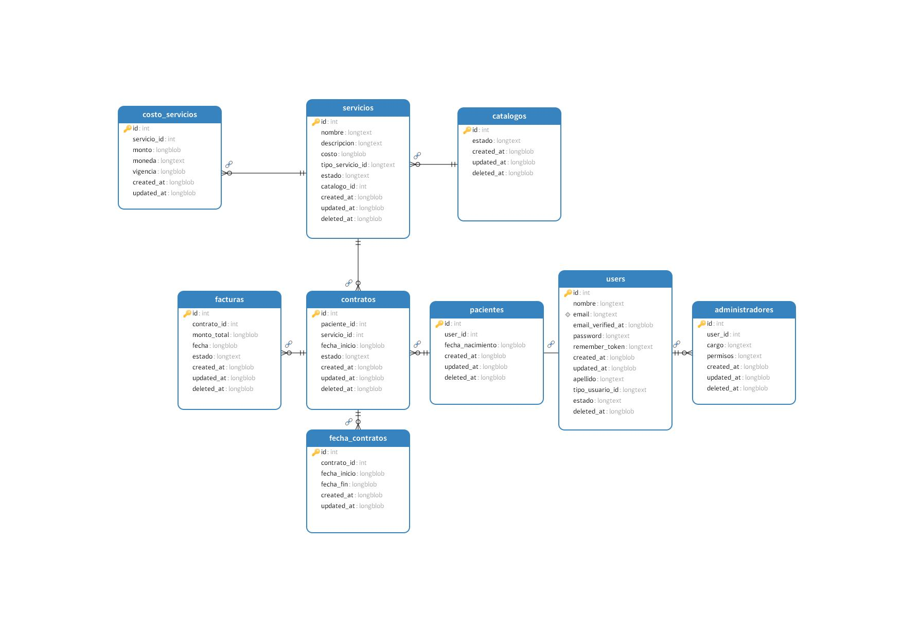

# Microservicio Comercial - Nur-tricenter

## Descripción

El Microservicio Comercial es un componente central del sistema Nur-tricenter que gestiona todos los aspectos comerciales y contractuales de los servicios nutricionales. Este microservicio es responsable de la gestión del catálogo de servicios, la administración de contratos y la facturación de los servicios ofrecidos por la empresa.

## Propósito

El propósito principal es proporcionar una plataforma robusta y escalable que permita:
- Gestionar el catálogo de servicios nutricionales
- Administrar los contratos de los pacientes
- Manejar el proceso de facturación
- Proporcionar una API para la integración con otros microservicios

## Funcionalidades

### 1. Gestión de Catálogo
- Definición y mantenimiento del catálogo de servicios
- Administración de precios y costos de servicios
- Actualización de estados de servicios
- Consulta de servicios disponibles

### 2. Gestión de Contratos
- Creación de contratos para servicios nutricionales
- Activación y cancelación de contratos
- Seguimiento del estado de contratos
- Consulta de historial de contratos por paciente

### 3. Facturación
- Generación automática de facturas
- Emisión de facturas por servicios contratados
- Gestión del estado de facturas
- Consulta de historial de facturación

### 4. Administración de Usuarios
- Gestión de perfiles de usuarios (Administradores y Pacientes)
- Validación de credenciales
- Actualización de información de usuarios
- Control de permisos y accesos

## Diagrama de Clases del Dominio

<p align="center">
  
</p>

## Base de Datos

<p align="center">
  
</p>

El diagrama muestra la estructura central del dominio, incluyendo:
- Agregados principales (Usuario, Catálogo, Contrato)
- Entidades (Administrador, Paciente, Factura)
- Objetos de valor (Email, CostoServicio, FechaContrato)
- Relaciones y comportamientos clave del dominio

## Tecnologías Utilizadas
- Laravel 11
- PHP 8.2+
- MySQL/PostgreSQL
- Laravel Modules

## Testing

Este proyecto implementa diferentes tipos de pruebas siguiendo las mejores prácticas de Domain-Driven Design y Clean Architecture:

### Tipos de Pruebas Implementadas
- Tests Unitarios
- Tests de Contrato (Contract Testing con Pact)
- Tests de Integración

### Documentación Detallada
Para una guía completa sobre la estrategia de testing, incluyendo:
- Estructura y organización de tests
- Convenciones y buenas prácticas
- Ejemplos de implementación
- Guía de Contract Testing con Pact
- Configuración y ejecución

👉 Ver la [Documentación Completa de Testing](tests/README.md)

### Ejecutar Tests

```bash
# Ejecutar todos los tests
./vendor/bin/phpunit

# Generar reporte de cobertura
./vendor/bin/phpunit --coverage-html coverage
```

# Unit Testing Project

Este es un proyecto de Laravel para practicar pruebas unitarias y de integración.

## Requisitos Previos

- PHP 8.2 o superior
- Composer
- Node.js (versión LTS recomendada)
- Git

## Instalación

1. Clonar el repositorio:
```bash
git clone https://github.com/Yh03l/unit-testing.git
cd unit-testing
```

2. Instalar dependencias de PHP:
```bash
composer install
```

3. Instalar dependencias de Node.js:
```bash
npm install
```

4. Configurar el entorno:
```bash
cp .env.example .env
php artisan key:generate
```

5. Configurar la base de datos:
- El proyecto está configurado para usar SQLite por defecto
- Se creará automáticamente el archivo de base de datos al ejecutar:
```bash
php artisan migrate
```

## Ejecutar el Proyecto

1. Iniciar el servidor de desarrollo:
```bash
php artisan serve
```

El proyecto estará disponible en `http://localhost:8000`

## Ejecutar Pruebas

Para ejecutar las pruebas unitarias:
```bash
php artisan test
```

Este comando iniciará:
- Servidor Laravel
- Cola de trabajos
- Logs en tiempo real
- Servidor de Vite

## Estructura del Proyecto

- `/app` - Código principal de la aplicación
- `/tests` - Pruebas unitarias y de integración
- `/src/Commercial` - Módulo de lógica comercial y código principal del microservicio
- `/database` - Migraciones y seeders

# Imagen Docker para Laravel con Apache

Esta imagen Docker está optimizada para ejecutar aplicaciones Laravel con Apache y PHP 8.2.4.

## Características

- PHP 8.2.4 con Apache
- Composer para gestión de dependencias
- Extensiones PHP esenciales:
  - mbstring
  - exif
  - pcntl
  - bcmath
  - gd
  - zip
  - pdo_pgsql
- Configuración optimizada para Laravel
- Soporte para mod_rewrite de Apache
- Permisos configurados correctamente para Laravel

## Uso

### Pull de la imagen

```bash
docker pull yh03lhz/nurjhz:latest
```

### Ejemplo de docker-compose

```yaml
services:
  app:
    image: yh03lhz/nurjhz:latest
    container_name: laravel-app
    ports:
      - "9092:80"
    volumes:
      - .:/var/www/html
      - vendor:/var/www/html/vendor
    networks:
      - app-network

volumes:
  vendor:

networks:
  app-network:
```

### Variables de Entorno

La imagen utiliza las variables de entorno estándar de Laravel. Asegúrate de tener un archivo `.env` configurado correctamente.

## Requisitos del Sistema

- Docker 20.10 o superior
- Docker Compose 2.0 o superior
- 2GB de RAM mínimo
- 10GB de espacio en disco

## Puertos

- El contenedor expone el puerto 80 internamente
- Por defecto, se mapea al puerto 9092 en el host

## Volúmenes

- `/var/www/html`: Directorio de la aplicación
- `/var/www/html/vendor`: Dependencias de Composer

## Red

La imagen está configurada para trabajar en una red Docker. Asegúrate de crear y conectar la red apropiada.

## Permisos

Los permisos están configurados automáticamente para:
- Directorio web: 755
- Directorio storage: 755
- Usuario: www-data

# Configuración de Linting y Pre-commit Hooks

Este documento explica los pasos realizados para configurar el entorno de desarrollo con herramientas de linting y pre-commit hooks.

## 1. Configuración de EditorConfig

Se modificó el archivo `.editorconfig` para establecer las reglas básicas de formato:

```ini
[*]
charset = utf-8
end_of_line = lf
indent_size = 4
indent_style = tab
insert_final_newline = true
trim_trailing_whitespace = true
```

**¿Por qué?**
- Para mantener consistencia en el formato del código entre diferentes editores
- Para forzar el uso de tabs en lugar de espacios
- Para establecer un estándar de indentación (4 caracteres)

## 2. Instalación de Husky y lint-staged

Se instalaron las siguientes dependencias:
```bash
npm install --save-dev husky lint-staged
```

**¿Por qué?**
- **Husky**: Para ejecutar scripts antes de los commits
- **lint-staged**: Para ejecutar linters solo en los archivos modificados

## 3. Configuración de Husky

Se inicializó Husky y se configuró el hook de pre-commit:
```bash
npx husky init
```

**¿Por qué?**
- Para asegurar que el código cumpla con los estándares antes de cada commit
- Para automatizar el proceso de verificación de código

## 4. Configuración de lint-staged

Se agregó la configuración en `package.json`:
```json
"lint-staged": {
  "*.{js,jsx,ts,tsx,php}": [
    "prettier --write",
    "eslint --fix"
  ]
}
```

**¿Por qué?**
- Para ejecutar los linters solo en los archivos que han sido modificados
- Para optimizar el tiempo de ejecución de las verificaciones

## 5. Instalación de ESLint y Prettier

Se instalaron las herramientas de linting:
```bash
npm install --save-dev prettier eslint @typescript-eslint/parser @typescript-eslint/eslint-plugin
```

**¿Por qué?**
- **ESLint**: Para detectar errores y problemas de estilo en el código
- **Prettier**: Para formatear el código automáticamente
- **@typescript-eslint**: Para soporte de TypeScript

## 6. Configuración de ESLint

Se creó el archivo `.eslintrc.json`:
```json
{
  "env": {
    "browser": true,
    "es2021": true,
    "node": true
  },
  "extends": [
    "eslint:recommended",
    "plugin:@typescript-eslint/recommended"
  ],
  "rules": {
    "indent": ["error", "tab"],
    "linebreak-style": ["error", "unix"],
    "quotes": ["error", "single"],
    "semi": ["error", "always"]
  }
}
```

**¿Por qué?**
- Para definir reglas específicas de linting
- Para configurar el soporte de TypeScript
- Para establecer reglas de formato consistentes

## 7. Configuración de Prettier

Se creó el archivo `.prettierrc`:
```json
{
  "useTabs": true,
  "tabWidth": 4,
  "singleQuote": true,
  "trailingComma": "es5",
  "semi": true,
  "printWidth": 100
}
```

**¿Por qué?**
- Para configurar el formateo automático del código
- Para mantener consistencia con las reglas de ESLint
- Para establecer límites de longitud de línea y otros formatos

## Flujo de Trabajo

1. Cuando realizas un commit:
   - Husky intercepta el commit
   - Ejecuta el hook de pre-commit
   - lint-staged identifica los archivos modificados
   - Prettier formatea los archivos
   - ESLint verifica el código
   - Si todo pasa, se permite el commit
   - Si hay errores, se detiene el commit

2. Beneficios:
   - Código consistente y bien formateado
   - Detección temprana de errores
   - Automatización del proceso de verificación
   - Mejor calidad de código
   - Menos conflictos en el control de versiones
