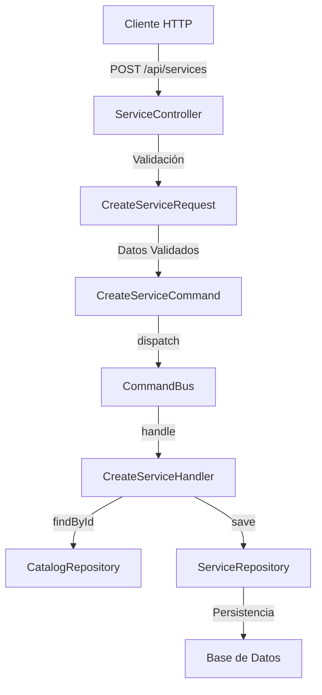
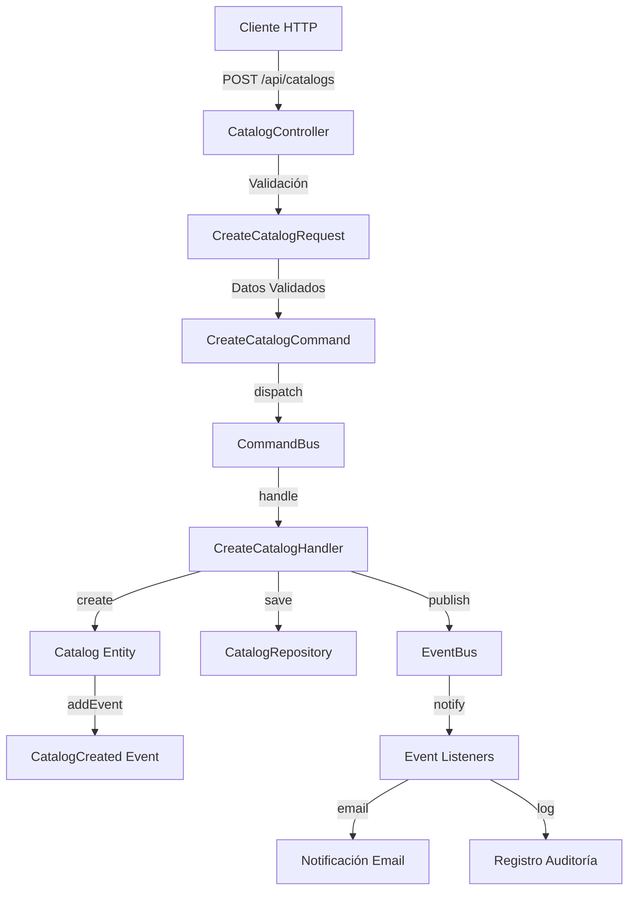

# Flujos de Peticiones en el Sistema

## 1. Flujo Básico: Crear Servicio (POST /api/services)

### Diagrama de Flujo


### Paso a Paso

1. **Entrada del Request**
```json
POST /api/services
{
    "nombre": "Consulta Nutricional",
    "descripcion": "Consulta nutricional personalizada",
    "monto": 50.00,
    "moneda": "BOB",
    "vigencia": "2024-12-31",
    "tipo_servicio_id": "1",
    "catalogo_id": "uuid-catalogo"
}
```

2. **Controller (ServiceController)**
```php
public function store(CreateServiceRequest $request): JsonResponse
{
    try {
        $command = new CreateServiceCommand(
            nombre: $request->validated('nombre'),
            descripcion: $request->validated('descripcion'),
            monto: (float) $request->validated('monto'),
            moneda: $request->validated('moneda'),
            vigencia: new DateTimeImmutable($request->validated('vigencia')),
            tipo_servicio_id: $request->validated('tipo_servicio_id'),
            catalogo_id: $request->validated('catalogo_id')
        );

        $this->commandBus->dispatch($command);
        return new JsonResponse(['message' => 'Servicio creado exitosamente'], Response::HTTP_CREATED);
    } catch (Exception $e) {
        return new JsonResponse(['error' => $e->getMessage()], Response::HTTP_BAD_REQUEST);
    }
}
```

3. **Command Handler (CreateServiceHandler)**
```php
public function __invoke(CreateServiceCommand $command): void
{
    $catalog = $this->catalogRepository->findById($command->getCatalogoId());
    if (!$catalog || !$catalog->isActive()) {
        throw CatalogException::catalogNotActive($command->getCatalogoId());
    }

    $service = new Service(
        id: Str::uuid()->toString(),
        nombre: $command->getNombre(),
        descripcion: $command->getDescripcion(),
        costo: new ServiceCost(
            monto: $command->getMonto(),
            moneda: $command->getMoneda(),
            vigencia: $command->getVigencia()
        ),
        tipo_servicio_id: $command->getTipoServicioId(),
        estado: ServiceStatus::ACTIVO,
        catalogo_id: $command->getCatalogoId()
    );

    $this->serviceRepository->save($service);
}
```

## 2. Flujo con Eventos: Crear Catálogo (POST /api/catalogs)

### Diagrama de Flujo


### Paso a Paso

1. **Entrada del Request**
```json
POST /api/catalogs
{
    "nombre": "Catálogo de Servicios Nutricionales",
    "estado": "activo"
}
```

2. **Controller (CatalogController)**
```php
public function store(CreateCatalogRequest $request): JsonResponse
{
    try {
        $command = new CreateCatalogCommand(
            nombre: $request->nombre,
            estado: ServiceStatus::fromString('activo')
        );

        $this->commandBus->dispatch($command);
        return new JsonResponse(['message' => 'Catálogo creado exitosamente'], Response::HTTP_CREATED);
    } catch (Exception $e) {
        return new JsonResponse(['error' => $e->getMessage()], Response::HTTP_BAD_REQUEST);
    }
}
```

3. **Command Handler (CreateCatalogHandler)**
```php
public function __invoke(CreateCatalogCommand $command): void
{
    $catalog = Catalog::create(
        id: Str::uuid()->toString(),
        nombre: $command->getNombre(),
        estado: $command->getEstado()
    );

    // Guardar en base de datos
    $this->repository->save($catalog);

    // Publicar eventos
    foreach ($catalog->getEvents() as $event) {
        $this->eventBus->publish($event);
    }

    // Limpiar eventos después de publicarlos
    $catalog->clearEvents();
}
```

4. **Entidad de Dominio (Catalog)**
```php
class Catalog
{
    private array $events = [];

    public static function create(string $id, string $nombre, ServiceStatus $estado): self
    {
        $catalog = new self($id, $nombre, $estado);
        $catalog->addEvent(new CatalogCreated($id, $nombre));
        return $catalog;
    }

    public function addEvent(object $event): void
    {
        $this->events[] = $event;
    }

    public function getEvents(): array
    {
        return $this->events;
    }

    public function clearEvents(): void
    {
        $this->events = [];
    }
}
```

5. **Evento de Dominio (CatalogCreated)**
```php
class CatalogCreated
{
    public function __construct(
        public readonly string $catalogId,
        public readonly string $nombre,
        public readonly DateTimeImmutable $occurredOn = new DateTimeImmutable()
    ) {}
}
```

6. **Event Bus (InMemoryEventBus)**
```php
class InMemoryEventBus implements EventBus
{
    private array $events = [];

    public function publish(object $event): void
    {
        $this->events[] = $event;
        
        // Aquí se dispararían los listeners
        // Por ejemplo:
        if ($event instanceof CatalogCreated) {
            // Notificar a administradores
            // Registrar en log de auditoría
            // Actualizar caché
            // etc.
        }
    }
}
```

### Diferencias Clave entre los Flujos

1. **Manejo de Eventos**
   - El flujo básico es lineal y síncrono
   - El flujo con eventos permite acciones secundarias desacopladas
   - Los eventos pueden ser manejados por múltiples listeners

2. **Persistencia de Datos**
   - El flujo básico solo guarda en la base de datos
   - El flujo con eventos puede disparar múltiples acciones:
     * Envío de notificaciones
     * Registro de auditoría
     * Actualización de caché
     * Sincronización con otros sistemas

3. **Arquitectura**
   - El flujo básico sigue CRUD simple
   - El flujo con eventos implementa Event Sourcing
   - Permite mejor escalabilidad y mantenibilidad

4. **Ventajas del Uso de Eventos**
   - Desacoplamiento de responsabilidades
   - Facilita la extensibilidad
   - Mejor trazabilidad de cambios
   - Permite implementar CQRS más fácilmente 