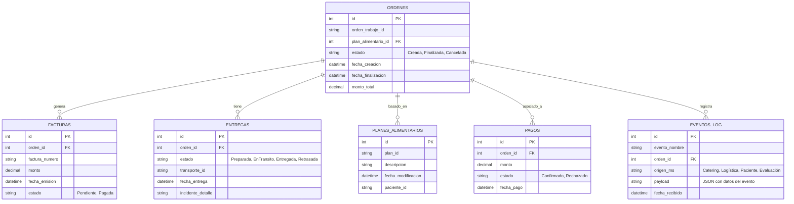

```mermaid
erDiagram
    ORDENES ||--o{ FACTURAS : genera
    ORDENES ||--o{ ENTREGAS : tiene
    ORDENES ||--o{ PLANES_ALIMENTARIOS : basado_en
    ORDENES ||--o{ PAGOS : asociado_a
    ORDENES ||--o{ EVENTOS_LOG : registra

    ORDENES {
        int id PK
        string orden_trabajo_id
        int plan_alimentario_id FK
        string estado "Creada, Finalizada, Cancelada"
        datetime fecha_creacion
        datetime fecha_finalizacion
        decimal monto_total
    }

    FACTURAS {
        int id PK
        int orden_id FK
        string factura_numero
        decimal monto
        datetime fecha_emision
        string estado "Pendiente, Pagada"
    }

    PAGOS {
        int id PK
        int orden_id FK
        decimal monto
        string estado "Confirmado, Rechazado"
        datetime fecha_pago
    }

    ENTREGAS {
        int id PK
        int orden_id FK
        string estado "Preparada, EnTransito, Entregada, Retrasada"
        string transporte_id
        datetime fecha_entrega
        string incidente_detalle
    }

    PLANES_ALIMENTARIOS {
        int id PK
        string plan_id
        string descripcion
        datetime fecha_modificacion
        string paciente_id
    }

    EVENTOS_LOG {
        int id PK
        string evento_nombre
        int orden_id FK
        string origen_ms "Catering, Logística, Paciente, Evaluación"
        string payload "JSON con datos del evento"
        datetime fecha_recibido
    }
```